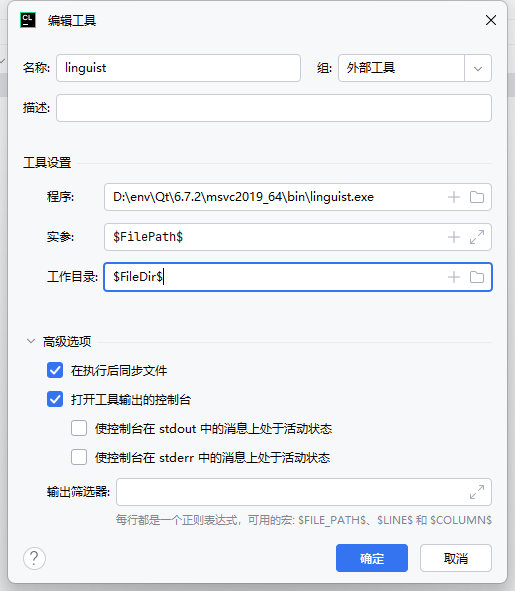
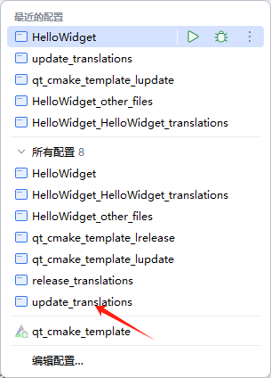

# 参考qt官方的cmake项目模板

1. widget 模板
2. quick 模板

# 多语言翻译

## Clion配置外部工具



## 方式一：CMake配置

```cmake
# 先清除cmake缓存
set(I18N
        i18n/zh-CN.ts # 目标翻译语言
)

qt_add_translations(TargetName (需要替换) TS_FILES ${I18N})

```

## 方式二： meson配置

```jetbrainsmeson
#ts = files(
#    'i18n/zh-CN.ts'
#)
#ts_files = qt6.compile_translations(ts_files : ts, build_by_default : true) # 单独编译为qm，加载时需要加载指定加载路径

ts_files = qt6.compile_translations(qresource : 'lang.qrc') # 嵌入到软件中，软件可通过translator.load(":/i18n/zh-CN.qm")来加载

```

```xml
<!--lang.qrc，meson需要手动编写才能嵌入，注意前缀为空-->
<RCC>
    <qresource prefix="">
        <file>i18n/zh-CN.qm</file>
    </qresource>
</RCC>
```

## 编写用于翻译的源代码

https://doc.qt.io/qt-6/i18n-source-translation.html

## 更新翻译(首次会创建该文件)



右键ts文件用外部工具linguist打开即可开始翻译，翻译完成后再次更新翻译

## 加载翻译文件

```c++
    QTranslator translator;
        // https://doc.qt.io/qt-6/qtlinguist-cmake-qt-add-translations.html#embedding-generated-qm-files-in-resources
        // By default, the generated .qm files are embedded in a Qt resource that will be linked into the targets passed
        // with TARGETS. The files in the resource are accessible under the resource prefix "/i18n".
    if (translator.load(":/i18n/zh-CN.qm")) {
        QApplication::installTranslator(&translator);
    }
```

# Reference

[qt cmake](https://doc.qt.io/qt-6/cmake-get-started.html)